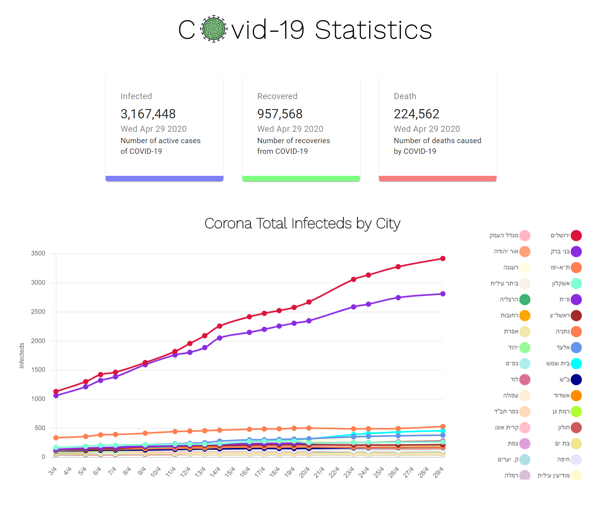

# React Covid-19 Tracker

A React JS application to Track Corona infected people using Material UI and Chart JS

<p align="center">
  
</p>

### Live demo
You can click [here](https://danielpaz6.github.io/react-covid-19-app/) for live demo.

### Installing

Clone and install dependecies

```
git clone https://github.com/danielpaz6/react-covid-19-app.git
cd react-covid-19-app
npm install
npm start
```
